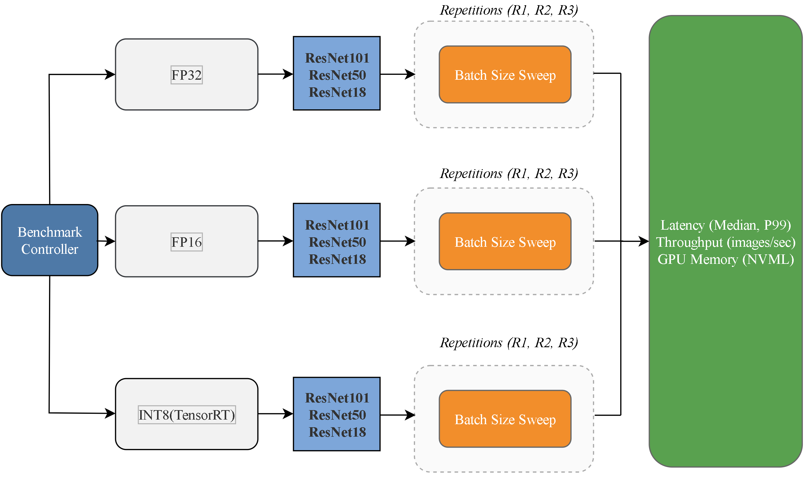

# DEEP-GAP: Deep-learning Evaluation of Execution Parallelism in GPU Architectural Performance

This repository provides the exact benchmarking scripts used in the DEEP-GAP study
to evaluate GPU inference performance across FP32, FP16, and INT8 precision modes.



------------------------------------------------------------------------

# 1. Overview

This benchmark measures:

-   Throughput (images/sec)
-   Median latency (ms)
-   P99 latency (ms)
-   Precision scaling effects (FP32 vs FP16 vs INT8)
-   GPU memory usage via NVML
-   Batch size scaling behavior
-   TensorRT optimization benefits

------------------------------------------------------------------------

# 2. Models Evaluated

-   ResNet-18
-   ResNet-50
-   ResNet-101

Pretrained ImageNet weights are used.

------------------------------------------------------------------------

# 3. Precision Modes

FP32 (PyTorch eager)
run_benchmark_resnet_18_50_101_FP32_NVML.py

FP16 (PyTorch half-precision)
run_benchmark_resnet_18_50_101_FP16_NVML.py

INT8 (TensorRT quantized inference)
run_benchmark_resnet_18_50_101_INT8_TensorRT_NVML.py

------------------------------------------------------------------------
# 4. Requirements

GPU with CUDA support (Tested on T4 and L4)

Linux (Ubuntu recommended)
Python 3.8+

Install dependencies:

pip install torch torchvision numpy pynvml

For INT8 TensorRT:

pip install tensorrt pycuda

------------------------------------------------------------------------

# 5. Benchmark Configuration

-   Warmup iterations: 20
-   Timed iterations: 100
-   Repeats per config: 3
-   Sweeps per config: 10

Batch sizes:
1,2,4,8,16,32,64,128,256,384,512

Input size:
3x224x224

------------------------------------------------------------------------

# 6. Running Benchmark

Run all:
``` bash
chmod +x run_all_benchmarks.sh
./run_all_benchmarks.sh
```
Or individually:
``` bash
cd FP32
python run_benchmark_resnet_18_50_101_FP32_NVML.py
```
``` bash
cd FP16
python run_benchmark_resnet_18_50_101_FP16_NVML.py
```
``` bash
cd INT8-TensorRT
python run_benchmark_resnet_18_50_101_INT8_TensorRT_NVML.py
```
------------------------------------------------------------------------

# 7. Output

Each script produces:

benchmark_results_final.csv

inside its respective folder.

Columns include:

-   timestamp
-   model
-   batch size
-   median latency
-   p99 latency
-   throughput
-   gpu memory usage
-   system metadata

------------------------------------------------------------------------

# 8. GPU telemetry script

``` bash
start_gpu_telemetry.sh
```
Continuously records GPU hardware metrics using nvidia-smi during benchmark execution.

The script captures:

-  GPU temperature
-  power consumption (W)
-  GPU utilization (%)
-  memory utilization (%)
-  total GPU memory used (MB)
-  SM clock frequency
-  memory clock frequency
-  GPU performance state (P-state)

Data is logged once per second and written to:
``` bash
gpu_telemetry_full_run.csv
```

Start telemetry before running benchmarks:
``` bash
./start_gpu_telemetry.sh
```

------------------------------------------------------------------------

# 9. TensorRT artifacts

INT8 script generates:

trt_artifacts/

Includes:

-   ONNX model
-   TensorRT engine
-   calibration cache

------------------------------------------------------------------------

# 10. Reproducibility

To reproduce results consistently, use the same batch sizes and iteration counts, ensure the GPU is not shared with other workloads, and allow a cooling interval between runs.

------------------------------------------------------------------------

# 11. Citation

DEEP-GAP: Deep-learning Evaluation of Execution Parallelism in GPU Architectural Performance
